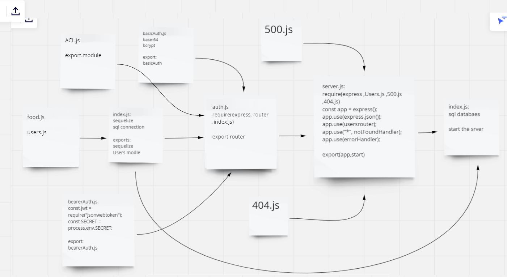

# auth-project

this a prototype application fo a resturant menu.

this application is a server that works on authntication with sign in and sign up and its connected to database to save the user name and password every time od sign up.

it also works on bearer Authorization witch generate a token every time of sign in and use this token with the request to validate the user.

this application has one API routes and it also has ACL to detremine the access of each end point based on the user type.

this website has two type of users
the Admin has the ability to delete and update accounts
the user has the ability to vrate account.

## UML

## linkes

[heroku](https://resturant-project-auth.herokuapp.com/)

https://github.com/saadomaralzoubi/auth-project/actions

### note :

this project done by :
- Mohammed Awadallah
- Saad Aalzubi
